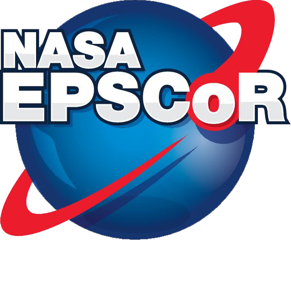

# OSO-LoGiC

  
  &nbsp; &nbsp; &nbsp; &nbsp; &nbsp; &nbsp; &nbsp; &nbsp; &nbsp; &nbsp; &nbsp; &nbsp; &nbsp; &nbsp; &nbsp; &nbsp;
  

This is the project repository for Assessing NASA’s Open Science Outlook for Environmental Justice and Resilience of the Louisiana Gulf Coast (OSO-LoGiC). We have also created a sub-repos for an associated project AGEJL-4-Equity.

The OSO-LoGiC project aimed “a) to enhance research capacity and competitiveness” by applying NASA Earth Science Data and Open Science approaches to Environmental Justice research along the Louisiana Gulf Coast. We focused on networking activities to ensure the capacity would “b) be scalable to a team approach for a larger future endeavor.” Project activities specifically focused on capacities to be responsive to NASA Earth Science Division priorities and program elements. Engagement with NASA program officers leading up to and during OSO-LoGiC contributed to the strategic alignment with new initiatives in Open Source Science and Environmental Justice. 

NASA designated 2023 as the Year of Open Science. The White House and sixteen federal agencies subsequently also declared a Year of Open Science. The OSO-LoGiC project has allowed Tulane, a member of the Louisiana Space Consortium network of higher education institutions, to engage in Open Science and Environmental Justice discussions alongside NASA experts at the large and important American Geophysical Union (AGU) conference. We have been able to train two graduate students in open science concepts as part of their environmental justice-focused research duties and advocate for open science with large groups of students and faculty at University events. We have been able to build open science interest networks not only with academics, but with well-respected environmental justice organizations such as the Louisiana Bucket Brigade, DSCEJ, and the Tulane Environmental Law Clinic. The OSO-LoGiC outputs are uploaded to this dedicated GitHub repository where they may be used by the wider community indefinitely. 

Project outputs directory with store:
1)Annexes of the project report with all the project outputs as of May 2023
2)Proposals related to OSO-LoGiC project activies
3)A set of lists or database of Louisiana-based open science and ej resarchers with related documents and maps

The research was supported in part by LA NASA EPSCOR and Louisiana Board of Regents Support Fund

